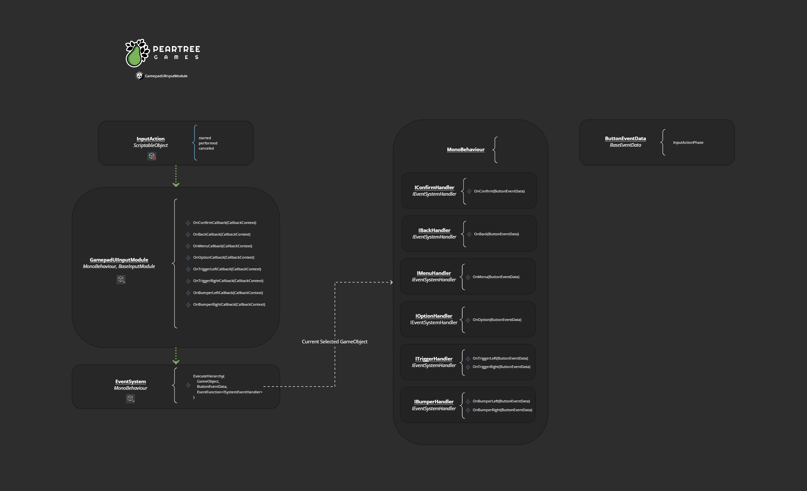

## Gamepad Module
Code from "Creating a Gamepad UI Input Module for Unity" [YouTube video](https://youtu.be/Uk_zrgHZjx8)

## Installation

Can be installed via the Package Manager > Add Package From Git URL...
`https://github.com/peartreegames/gamepad-module.git`

## Architectural Overview

## Changes

Added explicit DPad InputAction
